# City Air Tracker

Hourly air quality data for 50 U.S. cities, one per state. Pulled from the OpenWeather API, stored in PostgreSQL on AWS RDS, shown through a Dash dashboard with an AI assistant built in. Deployed live on Render.

This project was used as an example project for the Code the Dream Python Practicum.

**Live app:** [city-air-tracker.onrender.com](https://city-air-tracker.onrender.com)

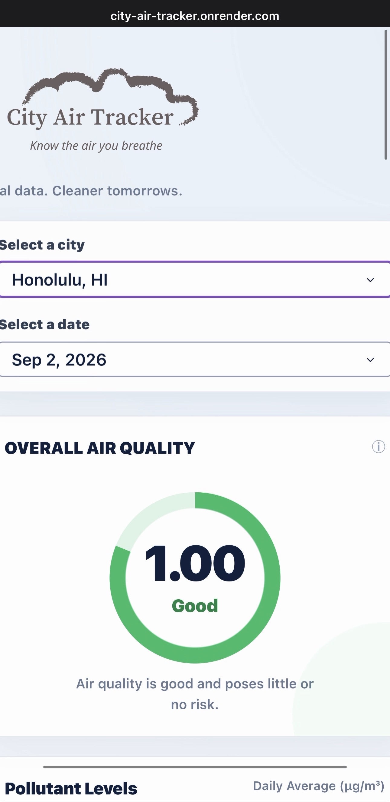

---

## What this does

Pulls hourly AQI readings for 50 cities across all 50 states and loads them into RDS, backfilled from January 1, 2026 and kept current with a daily scheduled pull. The dashboard reads directly from that data. The AI assistant built into the dashboard answers questions about air quality for whatever city and date you pick.

Scale: 50 cities x 24 readings a day = 1,200 rows a day, around 290,000 rows total from Jan 1, 2026 to now. About 1,500 API calls a month against a 1,000,000 limit. Runs on free tiers, so cost is close to $0.

---

## How it works

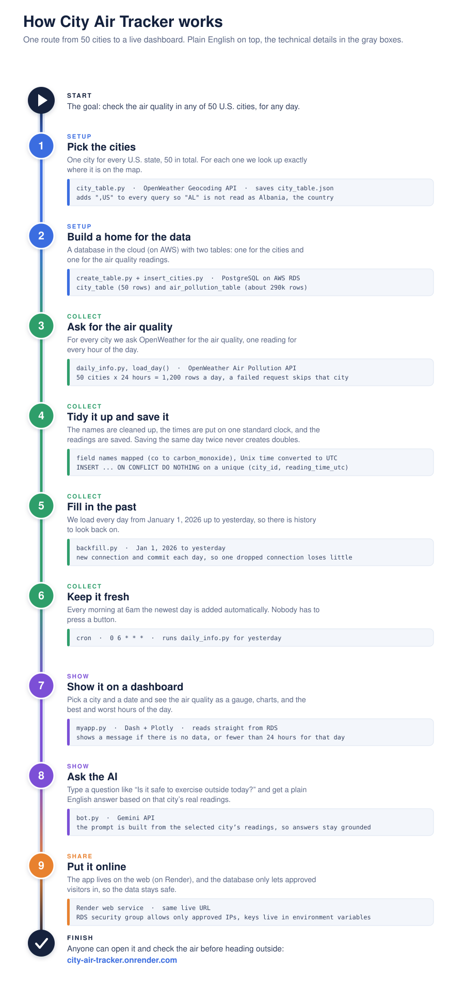

<details>
<summary>For the technical details, see the step by step flowchart for loading the data</summary>

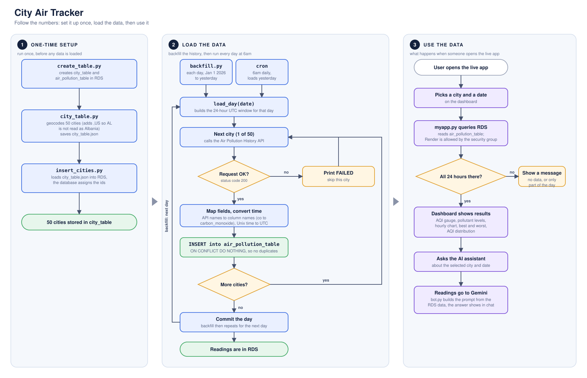

A quick note on the diamond that says "Request OK?": status 200 is the standard web code for "the request worked". `load_day()` checks it for every city. If the API sends back anything else, it prints FAILED for that city and moves on to the next one instead of stopping the whole run.

</details>

---

## Project structure

```
extract/
  city_table.py        geocodes all 50 cities against the OpenWeather Geocoding API, appending ",US" to each query to stop state codes from being misread as country codes (this is what fixed the Birmingham, AL / Albania bug). Writes the result to city_table.json.
  daily_info.py          load_day(): pulls the 24 hourly AQI/pollutant readings for a given date across all cities and inserts into air_pollution_table. Two pieces of this were pulled into their own functions so they can be tested without a live API or database connection: build_time_window(target_date) builds the start/end Unix timestamps for that day's 24hr UTC window, and map_pollution_fields(component) maps the API's short field names to schema column names (co -> carbon_monoxide, no -> nitric_oxide, etc). The transform step still lives in this file, it isn't a separate module yet, these are just the two parts pulled out so far.

load/
  create_table.py       creates city_table and air_pollution_table
  insert_cities.py       reads city_table.json and inserts the cities into city_table, letting the database assign the id, then prints out what's in the table so you can check it loaded right

orchestration/
  backfill.py             loops load_day() over a date range (Jan 1, 2026 to yesterday by default), opening a fresh connection each day so one dropped connection doesn't kill the whole run, and commits after each day so a crash partway through keeps whatever already finished

tests/
  test_extract_lilly.py   tests build_time_window(), confirming a given date produces the correct start and end UTC timestamps for that day
  test_field_mapping.py    tests map_pollution_fields(), confirming API field names map to the right schema columns, including zero values

myapp.py                   the dashboard app
bot.py                      AI assistant, pulls readings for a city and date range from RDS and asks Gemini for a summary and health advice
```

Both `extract/` and `tests/` need an empty `__init__.py` file for the imports between them to resolve correctly when running pytest. Without `tests/__init__.py` specifically, pytest only adds the `tests/` folder itself to the import path instead of walking up to the repo root, which breaks any import reaching back into `extract/`.

A unique constraint on `city_id` and `reading_time_utc` means running the load twice doesn't create duplicates. Same day loaded twice, same result. This is also what let the backfill pick back up clean after a dropped connection mid run, since `backfill.py` opens a new connection per day specifically so one bad connection doesn't take down the whole backfill.

**On splitting transform out into its own file:** the bulk of the transform logic (the parts not yet pulled into their own functions) still lives inside `load_day()` in `daily_info.py`. Splitting the rest out into its own `transform/` module is a bigger refactor, not done yet, but `build_time_window()` and `map_pollution_fields()` are a start in that direction, both are now independently testable with no live API call or DB connection needed.

---

## Database schema

**city_table**

| Column | Type | Notes |
|---|---|---|
| city_id | SERIAL, primary key | |
| city_name | VARCHAR(100) | |
| state | CHAR(2) | |
| lat | NUMERIC(9,6) | |
| lon | NUMERIC(9,6) | |

Unique constraint on `(city_name, state)`.

**air_pollution_table**

| Column | Type | Notes |
|---|---|---|
| id | BIGSERIAL, primary key | |
| aqi | INT | |
| city_id | INT, references city_table | |
| reading_time_utc | TIMESTAMP | |
| carbon_monoxide | NUMERIC | |
| nitric_oxide | NUMERIC | |
| nitrogen_dioxide | NUMERIC | |
| ozone | NUMERIC | |
| sulfur_dioxide | NUMERIC | |
| fine_particles | NUMERIC | |
| coarse_particles | NUMERIC | |
| ammonia | NUMERIC | |

Unique constraint on `(city_id, reading_time_utc)`.

---

## Why the frontend got rebuilt

The first version of the dashboard worked but wasn't something you'd show anyone. It was just basic charts with a date and a city dropdown. No styling, no branding, nothing that told you what you were even looking at. It was also never deployed, it only ran on a local machine.

**Before:**

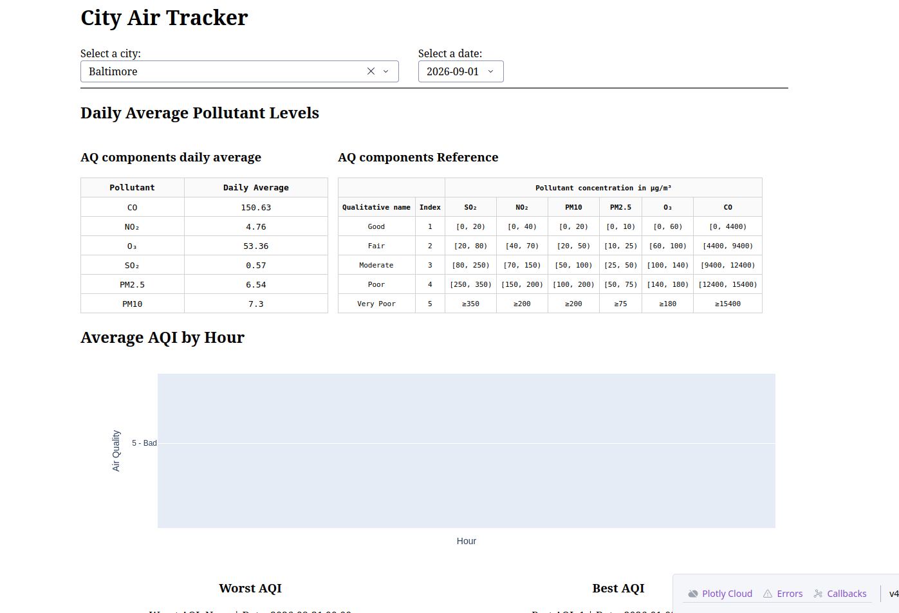
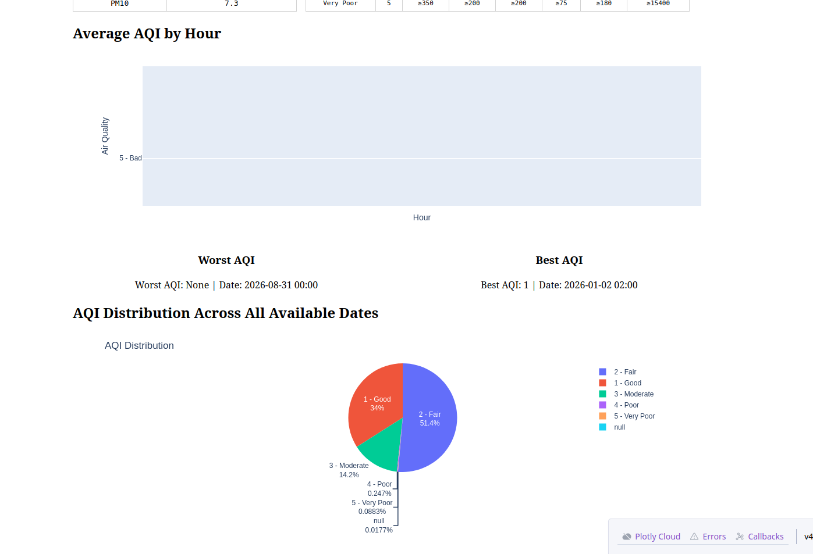

Close to the deadline it still hadn't been touched or pushed anywhere, so I took it on myself to rebuild it. Not restyle it, rebuild it.

What changed:

- A real CSS stylesheet with one consistent color system instead of default styling
- Card based layout, rounded corners, shadows, consistent spacing
- City Air Tracker branding and a logo, so it actually looks like a product
- A circular AQI gauge with five visual states, colors matched across the gauge, the guide, and the best/worst cards
- A clean pollutant panel for PM2.5, PM10, O3, NO2, SO2, CO
- Fixed a dropdown bug where the city options were rendering behind other cards
- Fully responsive, layout collapses on mobile and the AI input goes vertical
- Error handling added so an API issue shows a message instead of crashing the whole dashboard
- Actually deployed, running live on Render on Render's assigned port

**After:**

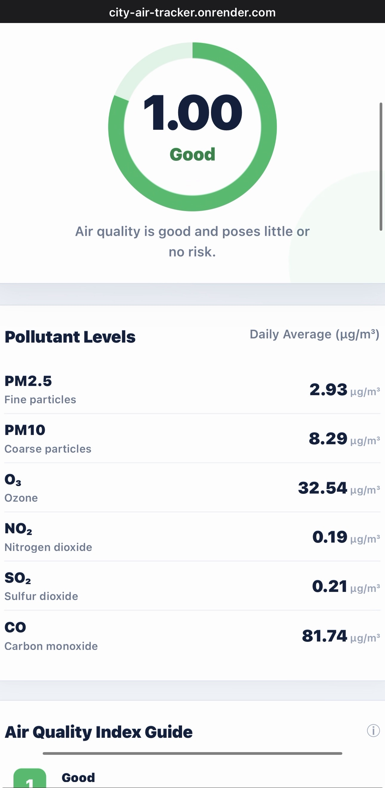
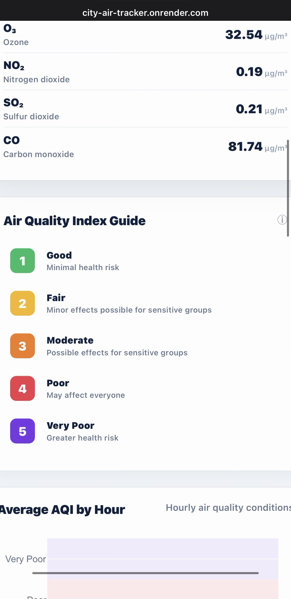
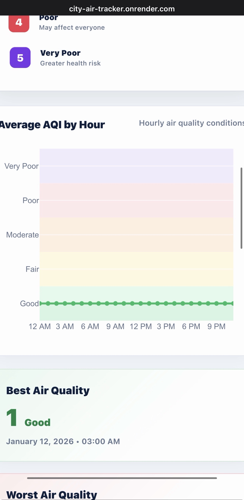
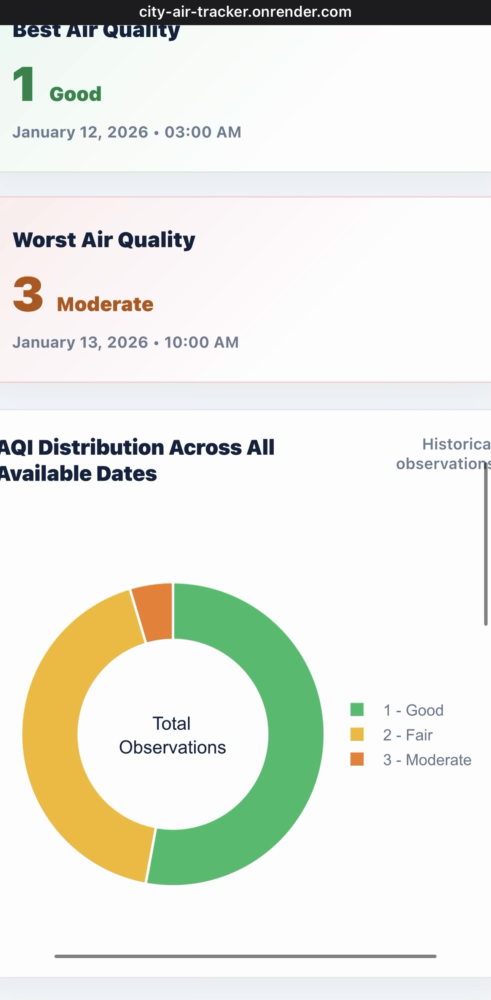
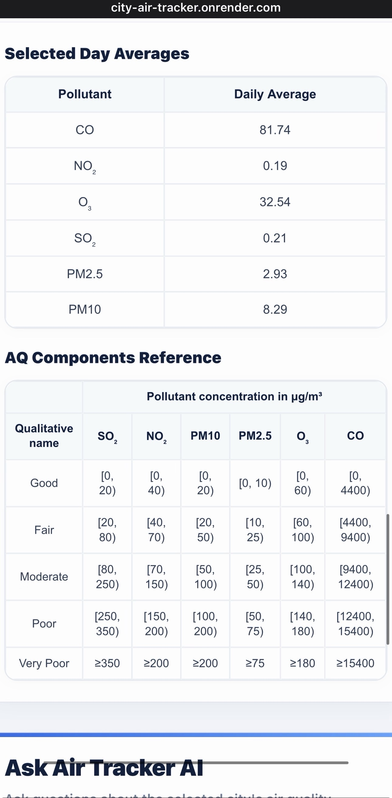

## The AI assistant

Not a button that spits out a canned summary. A real conversational assistant built into the dashboard. Chat history, an input box, an Ask button, separate styling for user messages vs AI messages.

Answers are grounded in the specific city and date selected, not general knowledge. The prompt tells the model the AQI scale here is a simple 1 to 5 scale, not the EPA's 0 to 500 scale, otherwise the model makes up EPA style numbers on its own.

Example questions it handles:
- "Is it safe to exercise outside today?"
- "Why is the AQI high?"
- "What pollutant is affecting this city?"
- "Should children spend time outside?"

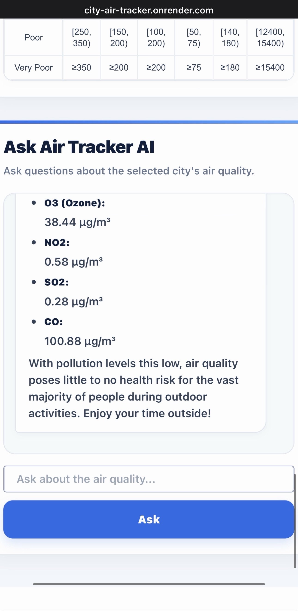

`bot.py` pulls the readings for a chosen city and date range straight from `air_pollution_table` joined to `city_table`, then sends that data to Gemini (`gemini-3.6-flash`) with two separate prompts, one for a plain language summary, one for general health precautions for sensitive groups (children, older adults, people with asthma), clearly labeled as not medical advice. Date range is capped at 14 days so it doesn't blow past the model's token limit. Bad dates, a start date after the end date, or too wide a range all get rejected with a clear message instead of the app just failing.

One deployment quirk worth knowing: the Gemini key I used locally hit its token limit during testing, and Gemini ties that limit to the project the key belongs to, not the environment. So the same key couldn't just be reused on Render, it would already be maxed out. The fix was generating a separate API key specifically for the deployed app, which is what actually lets the AI assistant respond once it's live instead of quietly failing.

---

## Setup

1. Clone the repo
```bash
git clone https://github.com/<your-username>/city-air-tracker.git
cd city-air-tracker
pip install -r requirements.txt
```

2. Set up your `.env`
```
OPENWEATHER_API_KEY=
DB_Host=
DB_Port=5432
DB_Name=
DB_USER=
DB_PASSWORD=
GEMINI_API_KEY=
```

3. Create the tables
```bash
python load/create_table.py
```

4. Load the cities
```bash
python load/insert_cities.py
```
Inserts the cities and lets the database assign the id, then prints out what's in the table so you can check it loaded right.

5. Backfill historical data
```bash
python orchestration/backfill.py
```
Loads daily data from January 1, 2026 through yesterday. Safe to run more than once, the unique constraint stops duplicates and lets it pick back up clean if it gets interrupted.

6. Schedule the daily pull
```bash
python extract/daily_info.py
```
Set up on cron so it runs on its own:
```
0 6 * * * cd /path/to/city-air-tracker && /path/to/.venv/bin/python extract/daily_info.py >> daily.log 2>&1
```
Only runs if the machine it's on is awake, that's the tradeoff of running cron locally instead of on a server.

7. Run the tests
```bash
pytest
```
Runs `test_extract_lilly.py` and `test_field_mapping.py`, neither needs a live API or database connection, both test pure logic pulled out of `daily_info.py`.

8. Run the app
```bash
python myapp.py
```

9. Point the live deployment at this repo
The app is already deployed on Render, connected to the same RDS database and using the same credentials. There's no need to create a new Render service or new credentials just because the code moved to a new repo. In the Render dashboard, go to the existing service's settings and change which GitHub repo it pulls from to this one. Everything else, the live URL, the database connection, the environment variables, stays the same.

---

## Security

- RDS security group only allows connections from specific IPs, scoped individually, never open to everyone
- Each person gets their own read only database user instead of sharing one master login
- Keys and DB credentials stay in `.env`, never committed to the repo

---

## Known issues

**Birmingham, AL got read as Albania. Already fixed.** The geocoding API took `AL` as the country code for Albania instead of the state code, came back empty, and crashed with an IndexError. About 1 in 5 state codes collide with country codes this way (DE, IN, LA, MD, MT, CO). Fixed in `city_table.py` by appending `,US` to every city query before hitting the geocoding endpoint.

**The 1 + 23 gap. My finding: it's an upstream API issue, not a bug in this code.** Some days show only 1 record instead of 24, always immediately followed by a day with 23 instead of 24, one day's readings splitting across two calendar dates. While debugging I traced it to specific rows (12 null rows for Baltimore at one point) and ruled out my code as the cause. Different cities hit it on different dates, which points to something on OpenWeather's end, not a shared bug here. Re-requesting those specific hours comes back empty, that data is just gone from the provider.


---

## Common questions

**Why not Lambda or EC2 for the scheduler?**
The daily job takes about 50 seconds. An EC2 instance would sit idle almost all the time. Lambda plus Secrets Manager is the planned next step. The database decouples the scheduler from everything downstream, so switching it later doesn't touch the dashboard or the AI assistant.

**What happens if the load runs twice?**
Nothing changes, the unique constraint blocks duplicate rows. That's also why the backfill was able to pick back up after a dropped connection.

**How do you know the data is right?**
50 cities times 24 hours should be 1,200 rows a day. Any other number is a red flag.

**Why keep incomplete data instead of dropping it?**
It gets stored as is and filtered when it's read. Dropping a row at load time just because one field is missing throws away good pollutant readings along with it.

**Why is AQI shown as 1 to 5?**
OpenWeather's API returns air quality as a 1 to 5 index (1 Good, 2 Fair, 3 Moderate, 4 Poor, 5 Very Poor). I kept that simple scale instead of converting it to the EPA's 0 to 500 scale, because I wanted something anyone could read at a glance, and I built the gauge, colors, and guide around it. It's labeled everywhere in the app so it's not confused with the standard scale.

**How does the frontend get new data?**
It queries RDS directly. When the 6am job finishes, the new rows just show up on the next page load, no separate step needed.

---

## Background

This started as a group project. I came up with the idea and brought it to the team, and they agreed it was a good one. Once we presented what we had so far, it wasn't what we were supposed to do, and with the deadline close I created my own folder and tested out my idea there. I extracted data for 50 cities and 50 states, stored it in RDS on AWS, built the backend, and presented it to the team.

The frontend was never styled or deployed, it was just basic charts running locally. So I took it on myself to rebuild the frontend, build and integrate the AI assistant, connect the frontend and backend together, deploy the whole thing on Render, and set up a cron scheduler to keep the data current.

What's in this repo is that build: the full pipeline (extract, load, orchestration), the RDS setup and security, the rebuilt dashboard, the AI assistant, and the Render deployment.

---

## License

MIT
